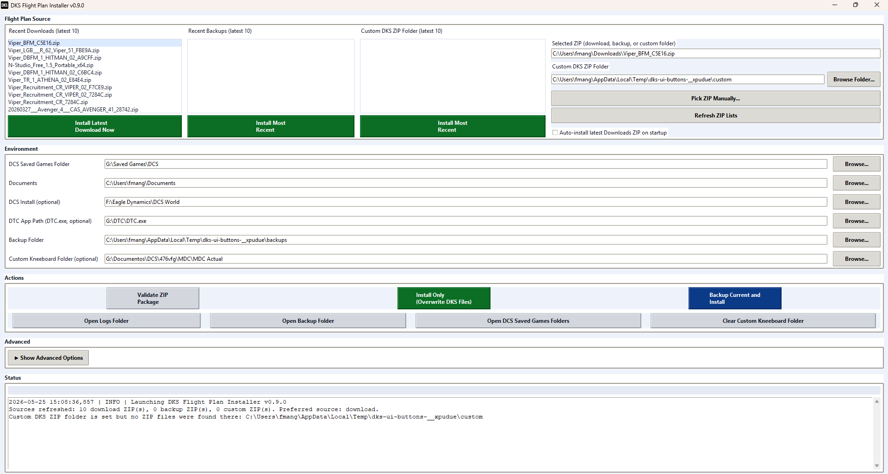
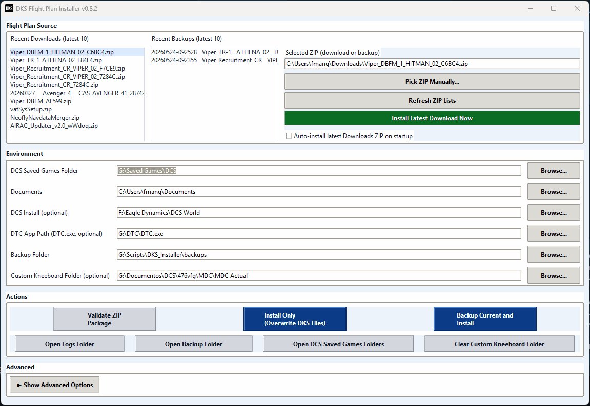
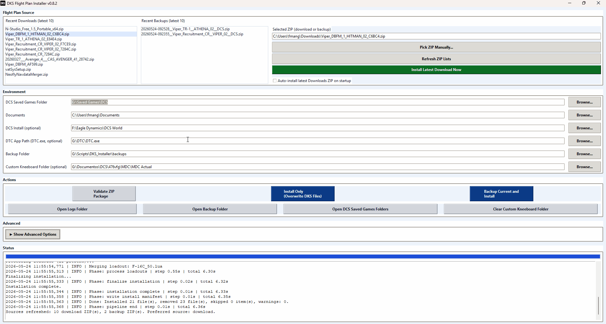
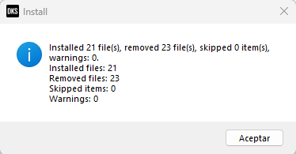

# DKS Installer - User Guide (Windows)

This guide explains how to install and use `DKSInstaller.exe`.

## Visual quickstart

> Add files to `docs/media/` using the filenames below to make these embeds render automatically.

### Main window overview

The main window is split into four working areas: package source selection, environment paths, action buttons, and advanced/status panels.

### Pick ZIP source + confirm paths (GIF)

Use the recent download list, backup list, or manual picker to select a DKS ZIP package, then confirm your DCS Saved Games and optional DTC/custom kneeboard paths.

### Run install action (GIF)

After selecting a package and confirming paths, run either **Install Only** or **Backup Current + Install**. The status panel logs each install phase and elapsed time.

### Completion summary dialog

At the end of the install, the summary dialog reports installed, removed, skipped, and warning counts.

## 1) Download and install the app

### Preferred method (GitHub Releases)

1. Open: https://github.com/VaporFlow/DKSInstaller/releases
2. Open the latest release.
3. In **Assets**, download `DKSInstaller.exe`.
4. Save it to a folder you control (for example `C:\Tools\DKSInstaller\`).
5. Double-click `DKSInstaller.exe` to launch.

No MSI setup is required for the current portable `.exe` workflow.

### If you do not see `DKSInstaller.exe` in Assets

Some releases may temporarily include only:
- `Source code (zip)`
- `Source code (tar.gz)`

In that case, wait for a release with binary assets, or build locally from source using the steps in `README.md`.

---

## 2) First run checklist

On first launch, verify these fields:

- **DCS Saved Games Folder**
  - Example: `C:\Users\<you>\Saved Games\DCS.openbeta`
- **DTC App Path (DTC.exe)** (optional)
  - Only needed if you want DTC auto-launch integration.
- **Custom DKS ZIP Folder** (optional)
  - Lets you surface ZIPs from a folder outside Downloads/backups.
- **Custom Kneeboard Folder** (optional)
  - Useful for mirrored export destinations.

Then choose a ZIP source:

- Recent Downloads ZIP list
- Recent Backups ZIP list
- Custom DKS ZIP Folder ZIP list
- Manual ZIP picker
- Auto-install latest ZIP

---

## 3) Install modes

### Install Only

Use when you want to apply a new package immediately.

Behavior:
- Removes prior tracked DKS files from target locations.
- Installs files from selected ZIP.
- Applies optional steps (DTC/loadouts) when available.

### Backup Current + Install

Use when you want a restore point before changes.

Behavior:
- Creates a backup ZIP of tracked files.
- Runs install flow after backup succeeds.
- Backup ZIP appears in recent backups and can be reused as install source.

---

## 4) Typical install flow

1. Launch `DKSInstaller.exe`.
2. Select a ZIP source (Downloads, Backups, Custom DKS ZIP Folder, or manual picker).
3. Confirm paths (Saved Games, optional DTC path, optional custom kneeboard path).
4. Click one action:
   - **Install Only**, or
   - **Backup Current + Install**
5. Wait for completion summary.
6. Review status counts:
   - Installed files
   - Removed files
   - Skipped items
   - Warnings

---

## 5) DTC notes

- If DTC integration is configured, the installer can prepare DTC output and optional auto-launch behavior.
- If `DTC.exe` is running and cannot be handled automatically, close DTC manually and retry.
- If DTC is not configured, core kneeboard install still works.

---

## 6) Backup and restore usage

- Backup files are created by **Backup Current + Install**.
- To restore previous state, select a backup ZIP from **Recent Backups** and run install.

---

## 7) Troubleshooting

### App does not start

- Right-click -> **Run as administrator** (only if your environment requires elevated access).
- Ensure antivirus did not quarantine the executable.

### Release has no `.exe`

- Check latest release again: https://github.com/VaporFlow/DKSInstaller/releases
- Use source build path from `README.md` until binary assets are attached.

### DCS path is wrong

- Manually set **DCS Saved Games Folder** in the app.

### Install completed with warnings

- Open logs from within the app and review the warning lines.
- Re-run with **Backup Current + Install** if you want a safe retry path.

---

## 8) Recommended update workflow

When a new release is published:

1. Download latest `DKSInstaller.exe` from Releases.
2. Replace your previous executable.
3. Launch and confirm your saved paths/preferences.
4. Run **Validate ZIP Package** before install for a quick sanity check.

---

## 9) Visual asset checklist (for maintainers)

Expected files in `docs/media/`:

- `01-main-window.png`
- `02-source-and-paths.gif`
- `03-install-action.gif`
- `04-completion-summary.png`

Recommended capture settings:

- PNG screenshots at 100% Windows scaling.
- GIFs 8-20 seconds, focused on one task each.
- Keep any personal paths/usernames redacted before upload.

Before publishing a release, confirm each media link renders correctly on GitHub.
